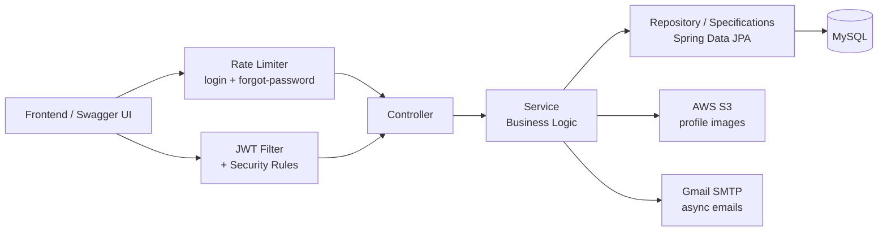
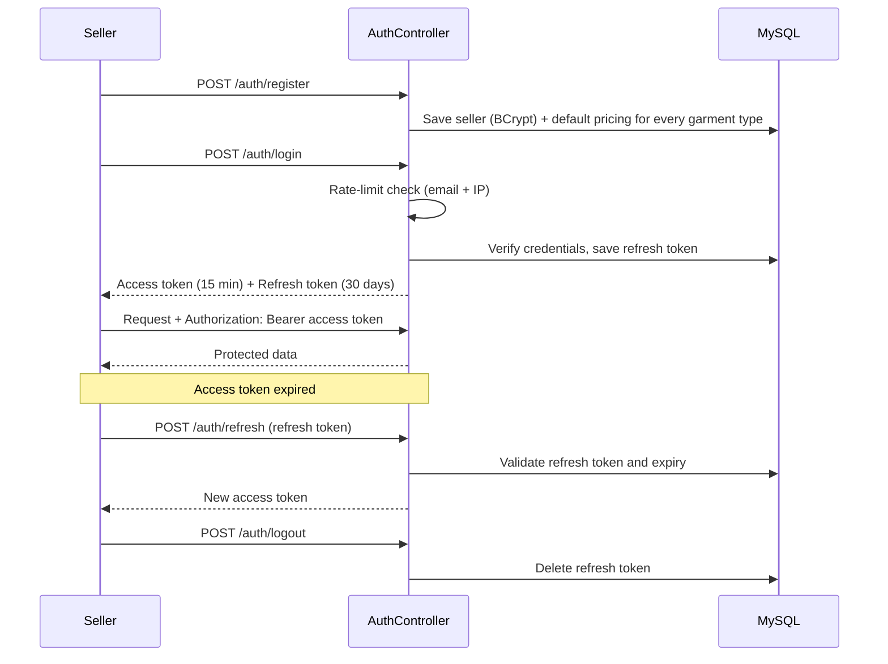
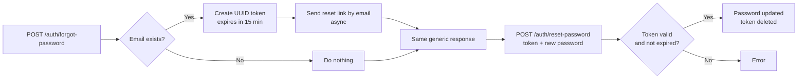
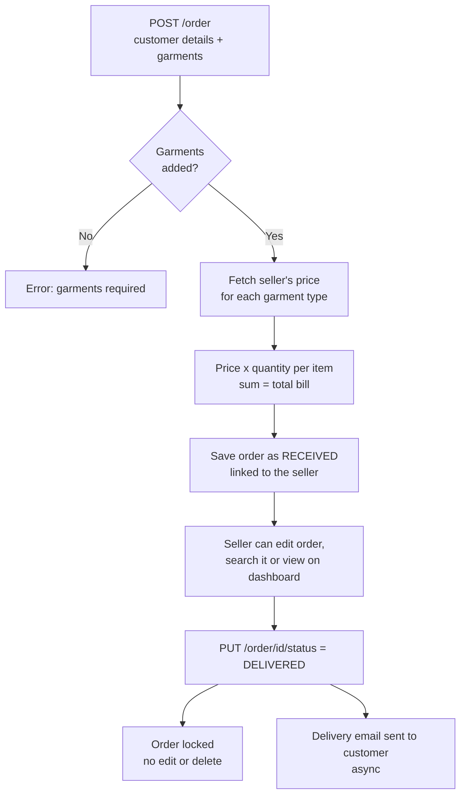
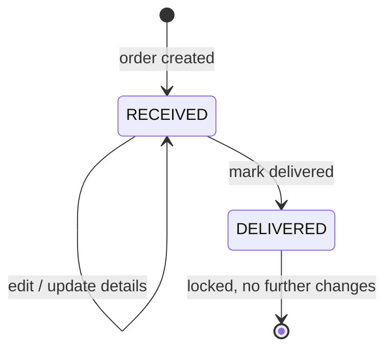
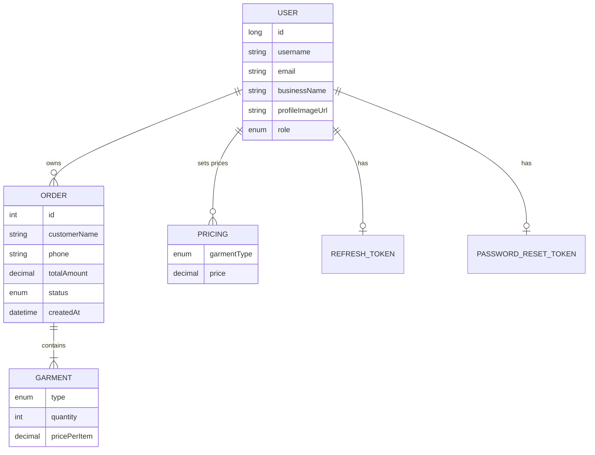

<div align="center">

# 🧺 Laundry Management Backend

**Multi-shop laundry management REST API with JWT auth, per-seller pricing, order tracking and a live dashboard**


</div>

---

## 📌 Overview

A backend for laundry shop owners (**sellers**) to run their business online. Each seller gets a private workspace with their own **price list, customer orders, profile and monthly dashboard**. Data of one shop is never visible to another.

**What a shop owner can do:**
register → set prices per garment → create orders for walk-in customers → track them until delivered → see monthly revenue at a glance.

---

## ✨ Features

| | Feature |
|---|---|
| 🔐 | **JWT access + refresh tokens** (15-min access token, 30-day refresh token stored in DB) |
| 🚪 | **Logout and token refresh**; refresh tokens are revoked on logout and password change |
| 🔑 | **Forgot / reset / change password** with a 15-minute email reset link |
| 🛡️ | **Rate limiting** on login and forgot-password using **Bucket4j** (per email + IP) |
| 👕 | **Per-seller pricing**: default price set for all 7 garment types at signup, editable anytime |
| 🧾 | **Orders**: multiple garments per order, bill auto-calculated from the seller's own prices |
| 🔍 | **Search & filters**: by order ID, status, customer name / phone / email, last N days |
| 📄 | **Pagination**: 10 per page, newest first, DB-level filtering using JPA Specifications |
| 📬 | **Delivery email** sent asynchronously when an order is marked delivered |
| 📊 | **Dashboard**: this month's orders, revenue and orders per status |
| 🖼️ | **Profile & photo**: business details, profile image uploaded to **AWS S3** |
| 🧹 | **Scheduled cleanup** of expired reset tokens (hourly) |
| 🧯 | **Global exception handling** with clean error responses |
| 📖 | **Swagger / OpenAPI** docs, plus a health-check endpoint |

---

## 🧰 Tech Stack

| Layer | Technology |
|---|---|
| Language | Java 21 |
| Framework | Spring Boot 3.3.4, Spring MVC |
| Security | Spring Security, JWT (jjwt 0.12.6), BCrypt, CORS |
| Database | MySQL, Spring Data JPA (Hibernate), JPA Specifications |
| Rate limiting | Bucket4j |
| File storage | AWS SDK v2 (S3) |
| Email | Spring Mail (Gmail SMTP) |
| API docs | springdoc-openapi (Swagger UI) |
| Build | Maven |
| Utilities | Lombok, Jakarta Validation |

---

## 🏗️ Architecture



---

## 🔑 Authentication Flow



### 🔁 Password reset



The response is identical whether or not the email exists, so attackers cannot find out which emails are registered.

---

## 🧾 Order Flow





Every order operation checks that the order **belongs to the logged-in seller**.

---

## 🗄️ Database Design



**Garment types:** `SHIRT` `PANT` `JEANS` `COAT_PANT` `BLAZER` `SAREE` `LEHENGA`

---

## 🔌 API Endpoints

Base path: `/api/v1`. Everything except Auth and Health needs `Authorization: Bearer <access_token>` with the `SELLER` role.

### 🔓 Auth
| Method | Endpoint | Access | Description |
|---|---|---|---|
| POST | `/auth/register` | Public | Register a seller (default prices created) |
| POST | `/auth/login` | Public, rate-limited | Get access + refresh tokens |
| POST | `/auth/refresh` | Public | Get a new access token |
| POST | `/auth/logout` | Public | Revoke refresh token |
| POST | `/auth/forgot-password` | Public, rate-limited | Email a reset link |
| POST | `/auth/reset-password` | Public | Set a new password using the token |
| PUT | `/auth/change-password` | Seller | Change password (forces re-login) |

### 🧾 Orders
| Method | Endpoint | Description |
|---|---|---|
| POST | `/order` | Create order (bill auto-calculated) |
| GET | `/order?id=&status=&search=&days=&page=` | Filter, search and paginate orders |
| GET | `/order/recent?page=&size=` | Most recent orders |
| PATCH | `/order/{id}` | Edit customer details or garments |
| PUT | `/order/{id}/status?status=` | Update status (`RECEIVED` / `DELIVERED`) |
| DELETE | `/order/{orderId}` | Delete order (not allowed once delivered) |

### 💰 Pricing, 📊 Dashboard, 👤 Profile, ❤️ Health
| Method | Endpoint | Description |
|---|---|---|
| GET | `/pricing` | View my price list |
| PUT | `/pricing/{garmentType}?price=` | Update price of a garment type |
| GET | `/dashboard` | This month's orders, revenue, orders per status |
| GET / PATCH | `/profile` | View / update business profile |
| PUT | `/profile/image` | Upload profile photo (multipart `file`) to S3 |
| DELETE | `/profile/image` | Remove profile photo |
| GET | `/health` | Health check (public) |

---

## 🗂️ Project Structure

```
src/main/java/com/example/LaundryApplication
├── configuration/
│   ├── Security/      SecurityConfig, JwtAuthenticationFilter, S3Config, UserDetailsService
│   ├── controller/    AuthController
│   ├── service/       AuthService, JwtService, RateLimitService
│   ├── dao, dto, model/   refresh token + reset token layers
├── controller/        Order, Pricing, Dashboard, Profile, Health
├── service/           Order, Pricing, Dashboard, Profile, ImageStorage (S3)
├── dao/               JPA repositories
├── model/             User, OrderEntity, Garment, Pricing
├── dto/               Request / response objects
├── transformer/       Entity <-> DTO mapping
├── enums/             Role, OrderStatus, GarmentType
├── utility/           Email, Validation, OrderSpecification, CleanUpService
└── ecxeption/         Custom exceptions + global handler
```

---

## ⚙️ Getting Started

### Prerequisites
Java 21 · Maven · MySQL · Gmail account with an app password · AWS account with an S3 bucket

### 1. Clone
```bash
git clone https://github.com/dhruvkhurana1626/laundry-management-backend.git
cd laundry-management-backend
```

### 2. Create the database
```sql
CREATE DATABASE laundryapplication;
```
Tables are created automatically (`ddl-auto=update`).

### 3. Set environment variables

| Variable | Purpose |
|---|---|
| `DB_USERNAME`, `DB_PASSWORD` | MySQL credentials |
| `jwt_secret` | Secret used to sign JWTs |
| `GMAIL_ACCOUNT`, `GMAIL_PASSWORD` | Gmail address and app password for sending emails |
| AWS credentials | Picked up from the standard AWS credential chain (`AWS_ACCESS_KEY_ID`, `AWS_SECRET_ACCESS_KEY`, or `~/.aws`) |

Also update `aws.s3.bucket-name` and `aws.region` in `application-prod.properties` to your own bucket.

### 4. Run
```bash
./mvnw spring-boot:run
```
Server starts on **http://localhost:8080**

### 5. Open Swagger UI
👉 **http://localhost:8080/swagger-ui/index.html**

---

## 🧪 Quick Test Flow

1. `POST /auth/register`, then `POST /auth/login` and copy the access token.
2. Click **Authorize** in Swagger and paste the token.
3. `GET /pricing` to see the default prices, and `PUT /pricing/SHIRT?price=30` to change one.
4. `POST /order` with a customer and a few garments. The bill is calculated for you.
5. `PUT /order/{id}/status?status=DELIVERED` and check `GET /dashboard`.

---

## 🚀 Future Improvements
- More order stages (e.g. In Process, Ready for Pickup)
- Redis-backed rate limiting
- Dashboard queries done in the database instead of in memory
- Docker + docker-compose setup
- Unit and integration tests

---

## 👤 Author

**Dhruv Khurana**
[GitHub](https://github.com/dhruvkhurana1626)
